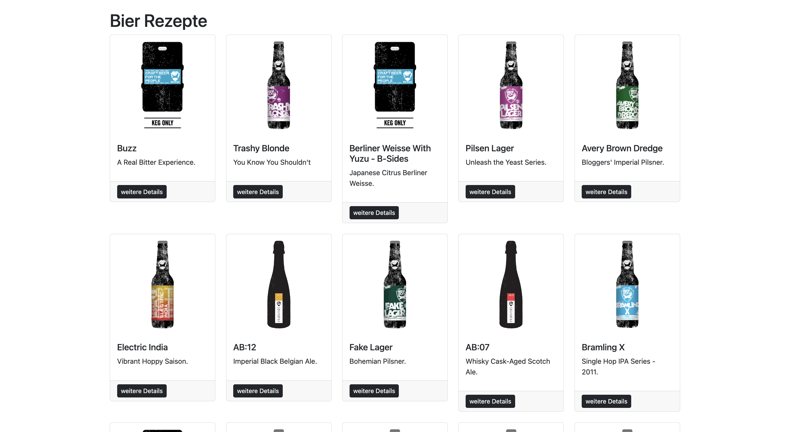
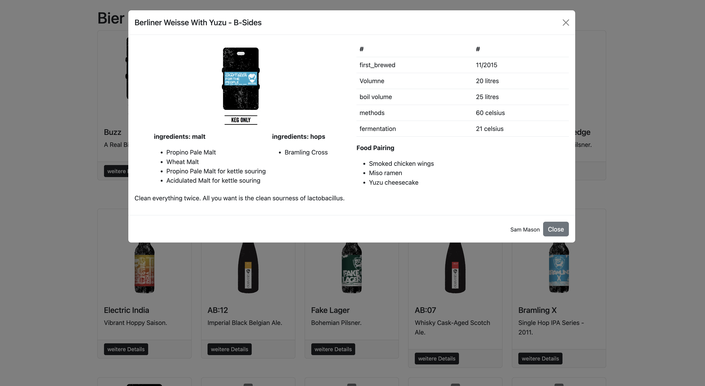

# ISC2UE Abgabe 4

Schreibe ein Programm, dass die [Biersorten der kostenlosen API](https://api.punkapi.com/v2/beers) zur Verfügung stellt.

In Ihrem Repository ist das Grundgerüst bereits vorhanden. Vervollständigen Sie das JavaScript damit die richtigen Daten angezeigt werden
Die Logik um die Details anzuzeigen ist bereits vorhanden.

Die fehlenden Bereiche sind im JavaScript Code mit ToDo gekennzeichnet.
Außerdem gibt es zu einzelnen ToDos Hinweise.

Am Ende soll es wie folgt aussehen:

|  |
|:---------------------------------------------------------------:|
|                         Übersichtseite                          |

|  |
|:-----------------------------------------------------------:|
|                        Detailansicht                        |

Das Layout wurde mit [Bootstrap](https://getbootstrap.com/), einem Frontend Framework aufgebaut.
Sollte Ihnen das Layout nicht zusagen steht es Ihnen frei Verbesserungen vorzunehmen.